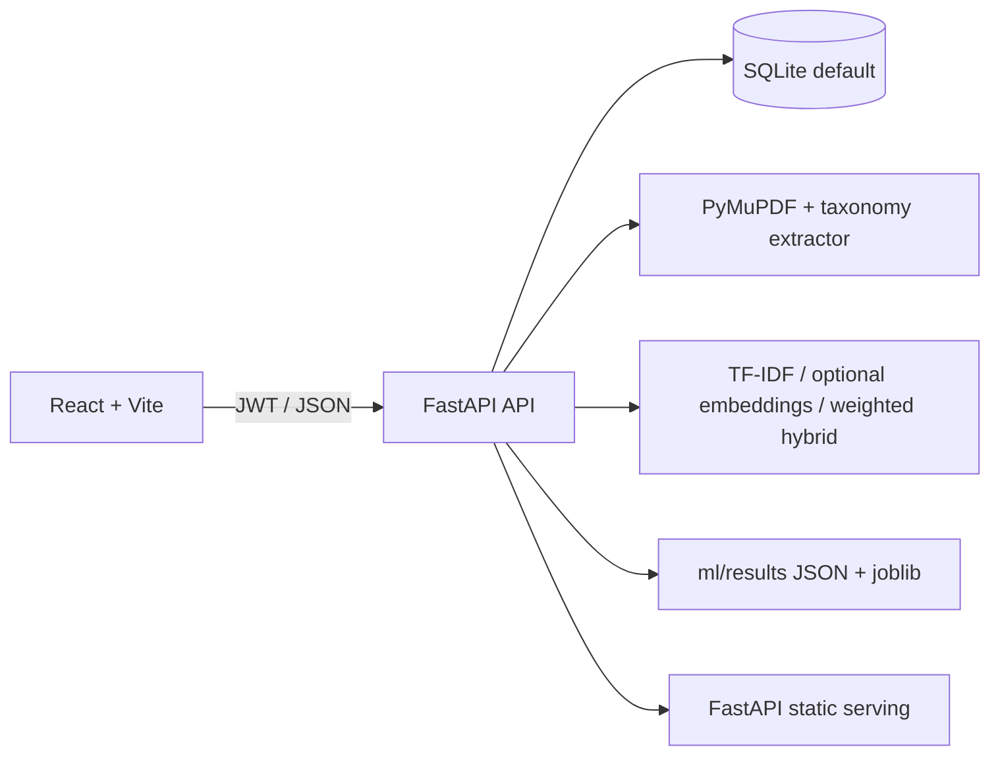

# SkillTrack architecture

## Runtime

- `backend/app/main.py` is the runnable FastAPI entrypoint and preserves the one-command demo.
- `backend/app/core/security.py` owns JWT and bcrypt.
- `backend/app/services/` owns parsing, taxonomy extraction and score computation.
- `backend/app/database.py` exposes SQLAlchemy 2.x engine/session metadata for the migration path.
- `frontend/src/App.jsx` consumes relative `/api/v1` routes and automatically retries one request after refreshing a JWT.
- `ml/` produces reproducible evaluation and placement artifacts. The admin endpoint reads those files instead of duplicating numbers.
